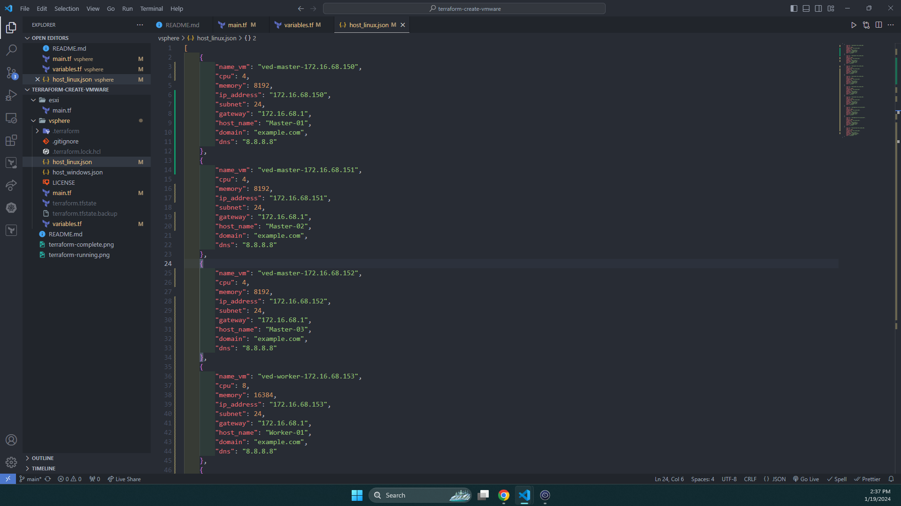

# Create template
{: .no_toc }

## Table of contents
{: .no_toc .text-delta }

1. TOC
{:toc}

## Declare the virtual machine configuration in the JSON file

In JSON file configuration for linux. It is has nine key and value pairs for virtual machine. It there include key and value below.

{: .note}
> You can create multiple virtual machine in vCenter by add other object in JSON file configuration for linux.
> <div markdown="block">
> {: .warning }
>> If you add other object in JSON file, you should add a `,` after the old object and at the beginning of the new object
> </div>

|        Key    |    Value        |
|:--------------|:----------------|
|`name_vm`      |Name of virtual machine in vCenter |
|`cpu`          |The number of CPUs allocated to the virtual machine |
|`memory`       |The number of Memory allocated to the virtual machine Ex: 4Gb -> 4096 |
|`ip_address`   |IP address allocated to the virtual machine |
|`subnet`       |Subnet mark allocated to the virtual machine Ex: 255.255.255.0 -> 24|
|`gateway`      |Gateway allocated to the virtual machine|
|`host_name`    |HostName in the OS|
|`domain`       |Domain name of OS, should set default the `default`|
|`dns`          |Domain Name System in the virtual machine|

After understanding more about the JSON file configuration, you can view image below.



## Configuration variable in the variables.tf

In this Terraform variable configuration section, you can see its content as below.

```tf
locals {
    ########    for create linux    ####################
    vm_configs = jsondecode(file("./host_linux.json"))
}

variable "vsphere_server" { # host/domain of vmware vsphere client
    type = string
    default = ""
}

variable "esxi_host" { # vmware esxi name
    type = string
    default = ""
}

variable "vsphere_dataCenter" { # name datacenter in vsphere
    type = string
    default = ""
}

variable "vsphere_dataStore" { # name datastore in vsphere
    type = string
    default = "Local Data"
}

variable "vsphere_network" { # name network in vsphere
    type = string
    default = "MNG"
}

variable "vsphere_template" { # name template in vsphere
    type = string
    default = "template-centos-terraform"
}

variable "vsphere_user" { # user login vmware vsphere client
    type = string
    default = "administrator@vsphere.local"
}

variable "vsphere_password" { # password login vmware vsphere client
    type = string
    default = ""
}
```

In the local values section as above, we will read the content of the JSON file that we previously configured above. And variables will list table below.

|        Variables    |    explain        |
|:--------------|:----------------|
|`vsphere_server`      |Host or domain access to vSphere Client|
|`esxi_host`          |IP address of esxi server|
|`vsphere_dataCenter`       |Name of Datacenter in the vSphere Client|
|`vsphere_dataStore`   |Name of storage of esxi|
|`vsphere_network`       |Config network for virtual machine|
|`vsphere_template`      |Template OS linux will create|
|`vsphere_user`         |User login vSphere Client|
|`vsphere_password`       |Password login vSphere Client|

{: .note }
You have enter info into the default of variable.

## Deploy vmware in vCenter with terraform

{: .note }
Before run terraform, you should access file main.tf to verify resource of linux hasn't comment and resource of windows has comment.

After configuration variable, you can run command `terraform plane` to verify configuration. After verify done, you have run command `terraform apply` and enter `yes`. After you wait to minutes for the terraform deploy virtual machine in the vSphere.

{: .warning}
After running command `terraform apply`, terraform has create two file is a terraform.tfstate and terraform.tfstate.backup. Both file has save configuration you just run. If you doesn't delete two file, terraform will delete all previously created resources and this has create new resource.